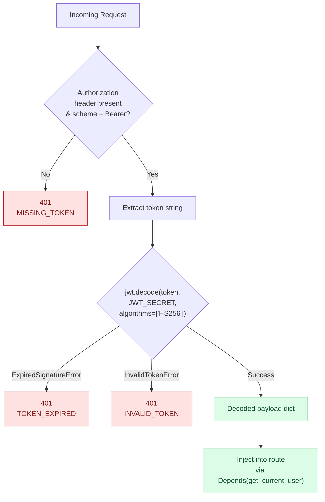

# Authentication

All protected endpoints use **JWT Bearer authentication**. This page explains the token format, the verification pipeline, error handling, and how to generate tokens for local development.

---

## Overview

The authentication scheme follows [RFC 6750](https://datatracker.ietf.org/doc/html/rfc6750) — clients include a signed JWT in every request:

```
Authorization: Bearer <jwt>
```

The token is verified server-side on every request. No sessions, no database lookups — stateless by design.

---

## Token Structure

A JWT has three Base64URL-encoded parts separated by dots:

```
eyJhbGciOiJIUzI1NiIsInR5cCI6IkpXVCJ9   ← Header
.eyJzdWIiOiJ1c2VyQGV4YW1wbGUuY29tIiwiZXhwIjo5OTk5OTk5OTk5fQ   ← Payload
.SflKxwRJSMeKKF2QT4fwpMeJf36POk6yJV_adQssw5c   ← Signature
```

### Header

```json
{
  "alg": "HS256",
  "typ": "JWT"
}
```

### Payload (Claims)

| Claim | Type | Required | Description |
|---|---|---|---|
| `sub` | `string` | **Yes** | Subject — typically a user ID or email |
| `exp` | `integer` | **Yes** | Unix timestamp — token is rejected after this time |
| `iat` | `integer` | No | Issued-at Unix timestamp |

### Signature

`HMAC-SHA256(base64url(header) + "." + base64url(payload), JWT_SECRET)`

The signature is what prevents clients from tampering with the payload.

---

## Verification Pipeline



---

## FastAPI Dependency Injection

Authentication is implemented as a FastAPI **dependency** — a reusable function that FastAPI calls before invoking a route handler:

```python
# src/api/auth.py
_bearer = HTTPBearer(auto_error=False)  # (1)

def get_current_user(
    credentials: HTTPAuthorizationCredentials = Depends(_bearer),
) -> dict:
    if credentials is None:               # (2)
        raise HTTPException(401, ...)
    return verify_token(credentials.credentials)  # (3)
```

1. `auto_error=False` means FastAPI won't auto-reject missing headers — we handle the 401 ourselves for a consistent `ErrorDetail` response
2. `None` means no `Authorization` header, or the scheme wasn't `Bearer`
3. `credentials.credentials` is the raw JWT string after stripping `Bearer `

Routes opt into auth by declaring the dependency:

```python
@router.get("/items")
async def list_items(current_user: dict = Depends(get_current_user)):
    ...
```

Routes that **omit** the dependency (e.g. `GET /health`) are fully public.

---

## Environment Variables

| Variable | Required | Default | Description |
|---|---|---|---|
| `JWT_SECRET` | **Yes** | — | HMAC signing secret — minimum 32 bytes recommended |
| `JWT_ALGORITHM` | No | `HS256` | JWT algorithm passed to `jwt.decode()` |

Both are read from the environment at call time (not at import time), making them injectable by Modal secrets, Docker env vars, or test fixtures.

!!! warning "Secret strength"
    Use a secret of at least 32 random bytes in any non-local environment. Generate one with:
    ```bash
    python -c "import secrets; print(secrets.token_hex(32))"
    ```

---

## Error Responses

Every auth failure returns a consistent `ErrorDetail` envelope:

```json
{
  "detail": {
    "detail": "Token has expired",
    "session_id": "550e8400-e29b-41d4-a716-446655440000",
    "error_code": "TOKEN_EXPIRED"
  }
}
```

| Scenario | HTTP | `error_code` |
|---|---|---|
| No `Authorization` header | `401` | `MISSING_TOKEN` |
| Header present but wrong scheme (e.g. `Basic`) | `401` | `MISSING_TOKEN` |
| Token `exp` is in the past | `401` | `TOKEN_EXPIRED` |
| Bad signature / malformed token | `401` | `INVALID_TOKEN` |
| Wrong algorithm | `401` | `INVALID_TOKEN` |

All `401` responses also include `WWW-Authenticate: Bearer` header per RFC 6750.

---

## Generating Tokens for Local Testing

=== "Python"

    ```python
    import jwt, time

    SECRET = "your-local-jwt-secret-at-least-32-bytes"

    token = jwt.encode(
        {
            "sub": "dev@example.com",
            "iat": int(time.time()),
            "exp": int(time.time()) + 3600,  # 1 hour
        },
        SECRET,
        algorithm="HS256",
    )
    print(token)
    ```

=== "curl + Python one-liner"

    ```bash
    TOKEN=$(python -c "
    import jwt, time
    print(jwt.encode(
        {'sub': 'dev@local', 'exp': int(time.time()) + 3600},
        'your-secret',
        algorithm='HS256'
    ))
    ")

    curl -s http://localhost:8000/api/v1/items \
      -H "Authorization: Bearer $TOKEN" | jq .
    ```

=== "In tests (conftest.py)"

    ```python
    # The test suite uses this helper — no real secret needed
    def make_token(sub="test@example.com", exp_offset=3600):
        return jwt.encode(
            {"sub": sub, "iat": int(time.time()), "exp": int(time.time()) + exp_offset},
            TEST_SECRET,
            algorithm="HS256",
        )
    ```

!!! tip "Running tests without JWT_SECRET"
    The test suite sets `JWT_SECRET` via `os.environ.setdefault()` in `conftest.py` before any imports. You never need to set `JWT_SECRET` in your shell to run `pytest`.

---

## Adding Auth to a New Route

```python
from src.api.auth import get_current_user

@router.get("/my-resource")
async def my_endpoint(current_user: dict = Depends(get_current_user)):
    user_sub = current_user["sub"]  # e.g. "user@example.com"
    return {"owner": user_sub}
```

The `current_user` dict contains the decoded JWT payload — use `current_user["sub"]` for the user identity.
