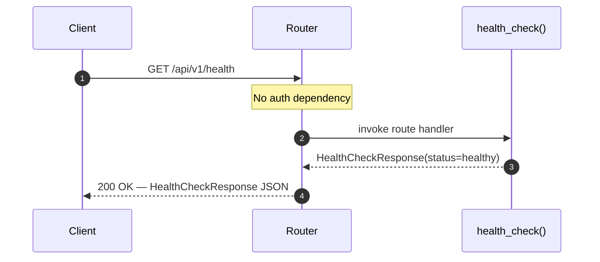
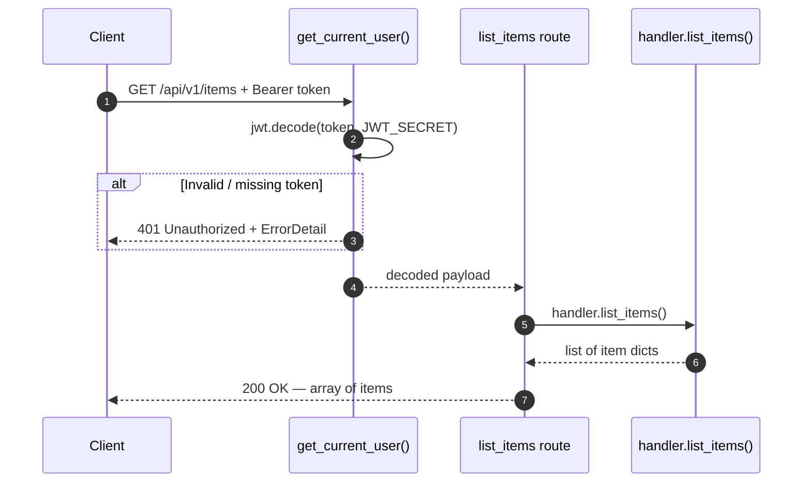
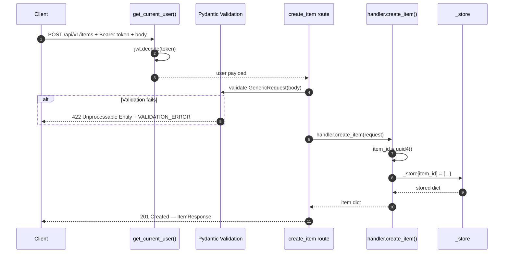
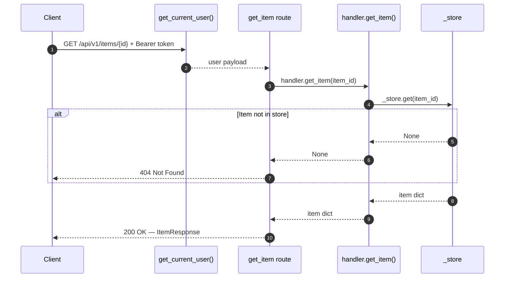
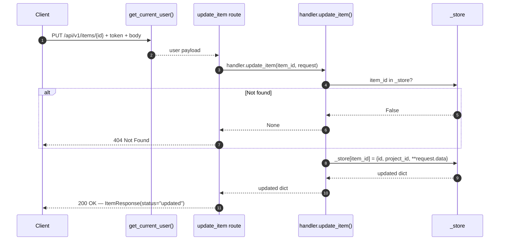
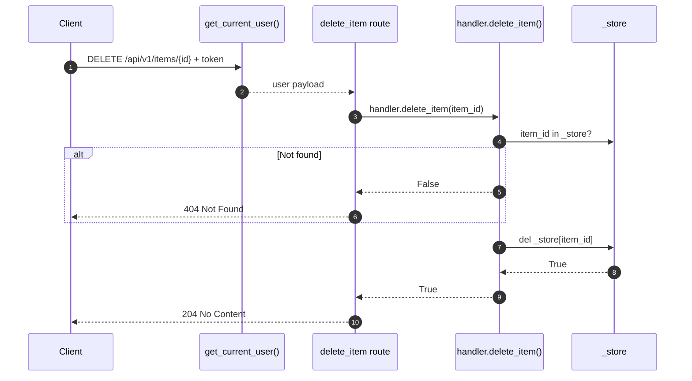

# Endpoints

Complete reference for all API endpoints — schemas, curl examples, and request flow diagrams.

!!! info "Base path"
    All endpoints are mounted under `/api/v1`. Examples below use `$BASE_URL` as a placeholder — replace with the appropriate [environment URL](index.md#base-url).

---

## Interactive API Explorer

<swagger-ui src="../swagger.yaml"/>

---

## `GET /health` — Health Check

<span class="method-get">GET</span> `/api/v1/health` · **No authentication required**

Returns the service health status, version, and a summary of internal service states. This endpoint is intentionally public so load balancers and uptime monitors can reach it without credentials.

### Response

```json
{
  "session_id": "550e8400-e29b-41d4-a716-446655440000",
  "status": "healthy",
  "service_name": "modal-template-fastapi",
  "version": "1.0.0",
  "services_summary": {
    "total": 1,
    "healthy": 1,
    "unhealthy": 0
  }
}
```

| Field | Type | Description |
|---|---|---|
| `session_id` | `string` (UUID) | Unique per-request trace ID |
| `status` | `"healthy"` \| `"unhealthy"` | Service state enum |
| `service_name` | `string` | Identifies the service |
| `version` | `string` | SemVer string |
| `services_summary` | `object` | Counts of healthy/unhealthy subsystems |

### curl

```bash
curl -s "$BASE_URL/health" | jq .
```

### Request Flow



---

## `GET /items` — List Items

<span class="method-get">GET</span> `/api/v1/items` · **JWT required**

Returns the full array of stored items. Returns an empty array `[]` when no items exist.

### Response

```json
[
  {
    "id": "a1b2c3d4-...",
    "project_id": "my-project",
    "name": "Widget Alpha",
    "value": 42
  }
]
```

### curl

=== "Success"

    ```bash
    curl -s "$BASE_URL/items" \
      -H "Authorization: Bearer $TOKEN" | jq .
    ```

=== "No token → 401"

    ```bash
    curl -s "$BASE_URL/items" | jq .
    # {
    #   "detail": {
    #     "detail": "Authorization header missing or malformed",
    #     "session_id": "...",
    #     "error_code": "MISSING_TOKEN"
    #   }
    # }
    ```

### Request Flow



---

## `POST /items` — Create Item

<span class="method-post">POST</span> `/api/v1/items` · **JWT required** · Returns `201 Created`

Creates a new item from an arbitrary `data` payload. The item receives a server-generated UUID as its `id`.

### Request Body

```json
{
  "data": {
    "name": "Widget Alpha",
    "value": 42,
    "tags": ["beta", "featured"]
  },
  "project_id": "my-project-123"
}
```

| Field | Type | Required | Description |
|---|---|---|---|
| `data` | `object` | **Yes** | Free-form payload stored verbatim |
| `project_id` | `string` | No | Minimum length 1 if provided |

### Response

```json
{
  "session_id": "550e8400-...",
  "status": "created",
  "message": "Item created successfully",
  "data": {
    "id": "a1b2c3d4-e5f6-...",
    "project_id": "my-project-123",
    "name": "Widget Alpha",
    "value": 42,
    "tags": ["beta", "featured"]
  }
}
```

### curl

=== "Success"

    ```bash
    curl -s -X POST "$BASE_URL/items" \
      -H "Authorization: Bearer $TOKEN" \
      -H "Content-Type: application/json" \
      -d '{"data": {"name": "Widget Alpha", "value": 42}, "project_id": "proj-1"}' \
      | jq .
    ```

=== "Missing data → 422"

    ```bash
    curl -s -X POST "$BASE_URL/items" \
      -H "Authorization: Bearer $TOKEN" \
      -H "Content-Type: application/json" \
      -d '{}' | jq .
    # {
    #   "detail": "...",
    #   "session_id": "...",
    #   "error_code": "VALIDATION_ERROR"
    # }
    ```

### Request Flow



---

## `GET /items/{item_id}` — Get Item

<span class="method-get">GET</span> `/api/v1/items/{item_id}` · **JWT required**

Retrieves a single item by its UUID. Returns `404` if the ID does not exist in the store.

### Path Parameters

| Parameter | Type | Description |
|---|---|---|
| `item_id` | `string` (UUID) | The item's unique identifier |

### Response

```json
{
  "session_id": "550e8400-...",
  "status": "success",
  "message": "Item retrieved successfully",
  "data": {
    "id": "a1b2c3d4-...",
    "name": "Widget Alpha",
    "value": 42
  }
}
```

### curl

=== "Success"

    ```bash
    ITEM_ID="a1b2c3d4-e5f6-7890-abcd-ef1234567890"

    curl -s "$BASE_URL/items/$ITEM_ID" \
      -H "Authorization: Bearer $TOKEN" | jq .
    ```

=== "Not found → 404"

    ```bash
    curl -s "$BASE_URL/items/nonexistent-id" \
      -H "Authorization: Bearer $TOKEN" | jq .
    # {"detail": "Item 'nonexistent-id' not found"}
    ```

### Request Flow



---

## `PUT /items/{item_id}` — Update Item

<span class="method-put">PUT</span> `/api/v1/items/{item_id}` · **JWT required**

Performs a **full replacement** of the item's data. The `id` is preserved; all other fields come from the request body.

### Request Body

Same schema as [POST /items](#post-items-create-item).

### curl

=== "Success"

    ```bash
    curl -s -X PUT "$BASE_URL/items/$ITEM_ID" \
      -H "Authorization: Bearer $TOKEN" \
      -H "Content-Type: application/json" \
      -d '{"data": {"name": "Updated Widget", "value": 99}}' \
      | jq .
    ```

=== "Not found → 404"

    ```bash
    curl -s -X PUT "$BASE_URL/items/ghost-id" \
      -H "Authorization: Bearer $TOKEN" \
      -H "Content-Type: application/json" \
      -d '{"data": {"x": 1}}' | jq .
    ```

### Request Flow



---

## `DELETE /items/{item_id}` — Delete Item

<span class="method-delete">DELETE</span> `/api/v1/items/{item_id}` · **JWT required** · Returns `204 No Content`

Permanently removes an item from the store. Returns `204` on success (no body), `404` if the item does not exist.

### curl

=== "Success (204 — no body)"

    ```bash
    curl -s -o /dev/null -w "%{http_code}" \
      -X DELETE "$BASE_URL/items/$ITEM_ID" \
      -H "Authorization: Bearer $TOKEN"
    # 204
    ```

=== "Not found → 404"

    ```bash
    curl -s -X DELETE "$BASE_URL/items/ghost-id" \
      -H "Authorization: Bearer $TOKEN" | jq .
    # {"detail": "Item 'ghost-id' not found"}
    ```

### Request Flow



---

## Error Reference

All auth and validation errors return a structured `ErrorDetail` body:

```json
{
  "detail": {
    "detail": "Human-readable error message",
    "session_id": "550e8400-...",
    "error_code": "MACHINE_READABLE_CODE"
  }
}
```

| HTTP Status | `error_code` | Cause |
|---|---|---|
| `401` | `MISSING_TOKEN` | No `Authorization` header, or scheme is not `Bearer` |
| `401` | `TOKEN_EXPIRED` | JWT `exp` claim is in the past |
| `401` | `INVALID_TOKEN` | Signature mismatch, malformed JWT, wrong algorithm |
| `404` | _(FastAPI default)_ | Item ID not found in store |
| `422` | `VALIDATION_ERROR` | Request body failed Pydantic validation |
