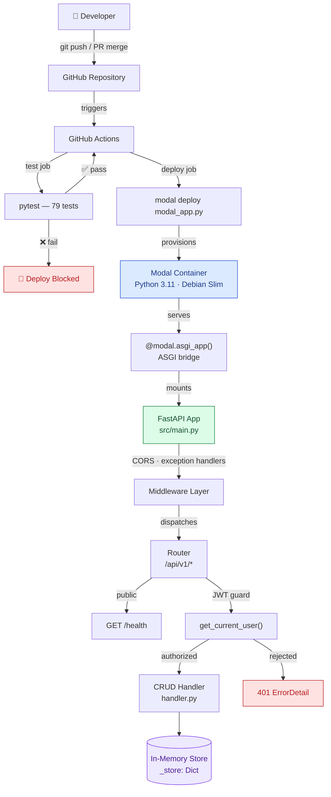
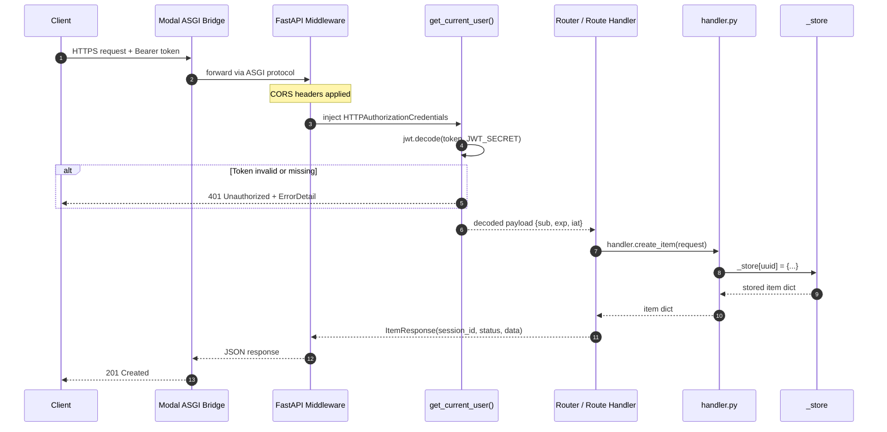
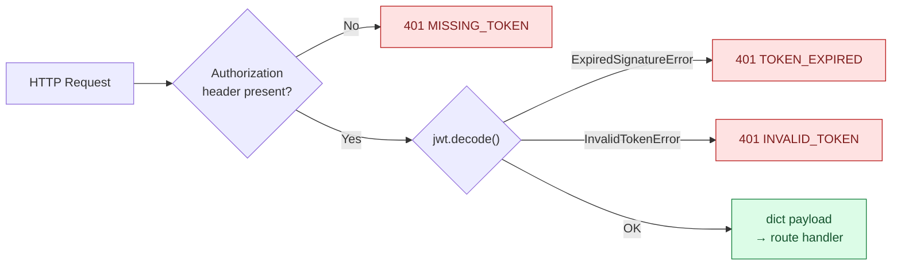
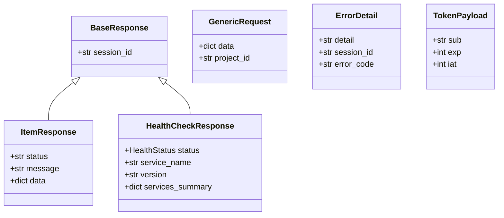

# Architecture

A bird's-eye view of how the project is structured, how components relate, and how a request moves from a client to a response.

---

## System Overview

The project is composed of three distinct layers that collaborate to deliver a production-grade serverless API:

| Layer | Components | Responsibility |
|---|---|---|
| **Infrastructure** | Modal, GitHub Actions | Compute scheduling, secret injection, CI/CD |
| **Application** | FastAPI, Pydantic, PyJWT | HTTP handling, validation, authentication |
| **Data** | In-memory `_store` dict | Ephemeral item storage (swap for a real DB) |

---

## High-Level Component Diagram



---

## Request Lifecycle

How a single authenticated API call flows end-to-end through the stack.



---

## Module Reference

### `modal_app.py` — Entry Point

The thin bridge between Modal and FastAPI.

```python
@app.function(**build_fastapi_config(env_config))  # (1)
@modal.asgi_app()                                   # (2)
def fastapi_app():
    from src.main import app as fastapi_app
    return fastapi_app                              # (3)
```

1. Applies all hardware, secret, and volume config from `EnvConfig`
2. Tells Modal this function handles ASGI traffic (HTTP/WebSocket)
3. Returns the FastAPI app instance — Modal routes all requests into it

The `@app.local_entrypoint()` allows `modal run modal_app.py` to start a local `uvicorn` server without deploying.

---

### `modal_common.py` — Environment Configuration

Central configuration registry. Two primary responsibilities:

**1. Container image definition**

```python
cpu_image = (
    modal.Image.debian_slim(python_version="3.10")
    .apt_install("curl", "jq")
    .uv_pip_install("fastapi", "uvicorn[standard]", "websockets", "pydantic", "PyJWT")
    .add_local_dir(".", remote_path="/root")
)
```

The image is built once and cached by Modal. `add_local_dir` copies the entire repo into `/root` inside the container.

**2. `EnvConfig` dataclass**

```python
@dataclass
class EnvConfig:
    env_name: str
    app_name: str = "modal-template-fastapi"
    custom_domain: Optional[str] = None
    cpu_core_count: int = 1
    ram_memory_mib: int = 256
    gpu_type: Optional[str] = None
    server_hard_timeout_seconds: int = 150
    min_containers: int = 0
    secrets: list = field(default_factory=list)
    volumes: Dict[str, modal.Volume] = field(default_factory=lambda: FASTAPI_VOLUME)
```

`get_env_config(env_name)` validates and returns the right config. `build_fastapi_config(env)` translates it into a dict of Modal function kwargs.

---

### `src/main.py` — FastAPI Application Factory

Responsibilities:

- Creates the `FastAPI` app with title, description, and version
- Attaches `CORSMiddleware` allowing all origins (tighten in production)
- Registers a global `RequestValidationError` handler that returns a structured `ErrorDetail` with `VALIDATION_ERROR` code
- Mounts the API router under `/api/v1`
- Logs startup/shutdown via the `lifespan` context manager

---

### `src/api/routes.py` — Router

Five routes, two patterns:

| Pattern | Routes | Auth |
|---|---|---|
| Public | `GET /health` | None |
| Protected | `GET /items`, `POST /items`, `GET /items/{id}`, `PUT /items/{id}`, `DELETE /items/{id}` | `Depends(get_current_user)` |

Each route delegates business logic entirely to `handler.py` — the route layer only maps HTTP semantics (status codes, response models) onto handler return values.

---

### `src/api/auth.py` — JWT Dependency



`JWT_SECRET` and `JWT_ALGORITHM` (default `HS256`) are read from environment variables at call time — not at import time — so they can be injected by Modal secrets or set in test fixtures.

---

### `src/api/handler.py` — Business Logic

An intentionally simple in-memory store using a module-level `dict`:

```python
_store: Dict[str, Dict[str, Any]] = {}
```

Each item is keyed by a UUID and stores all fields from the request `data` payload plus `id` and `project_id`. **This is the layer to replace** when wiring up a real database — the routes and models need zero changes.

---

### `src/api/models.py` — Pydantic Models



All responses carry a unique `session_id` (UUID v4 generated per request) for distributed tracing and support correlation.

---

## Environment Model

Three named environments, each with independent Modal app names, secrets, and scaling config:

| Field | `feat` | `dev` | `prod` |
|---|---|---|---|
| Modal app name | `modal-template-fastapi-feat` | `modal-template-fastapi-dev` | `modal-template-fastapi-prod` |
| Custom domain | `feat-app.modal.run` | `dev-app.modal.run` | `prod-app.modal.run` |
| CPU cores | 1 | 1 | 1 |
| RAM (MiB) | 256 | 256 | 256 |
| Min containers | 0 (scale to zero) | 0 (scale to zero) | **1** (always warm) |
| Secrets | `fastapi-auth-secrets` | `fastapi-auth-secrets` | `fastapi-auth-secrets` |
| Deploy trigger | `push feat/**` | `PR merged → dev` | `PR merged → production` |

!!! tip "Adding a new environment"
    1. Add a new `EnvConfig(env_name="staging", ...)` instance to `modal_common.py`
    2. Add it to `ENV_CONFIGS` dict
    3. Add a GitHub Actions variable (`vars.STAGING`) in the repo settings
    4. Add the routing condition to the `Set Modal environment` step in `modal-deploy.yml`
