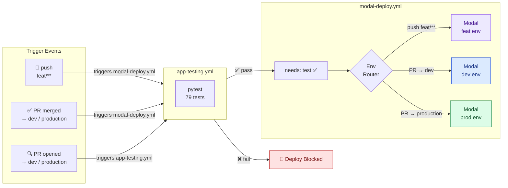
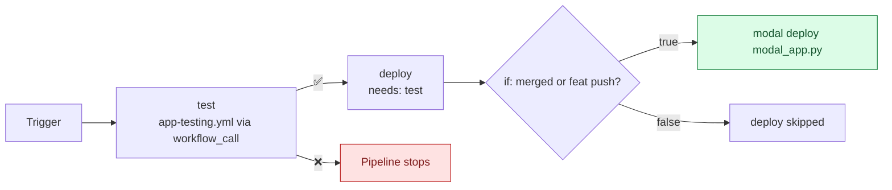

# CI/CD

Two GitHub Actions workflows implement a **test-gated deployment pipeline** — no code reaches Modal unless all 79 tests pass first.

---

## Pipeline Overview



---

## `app-testing.yml` — Test Workflow

**File:** `.github/workflows/app-testing.yml`

### Triggers

| Event | Condition | Purpose |
|---|---|---|
| `pull_request` | Targeting `dev` or `production` | Early feedback before merge |
| `workflow_call` | — | Called by `modal-deploy.yml` as a prerequisite job |

The dual trigger design means tests run **twice** in a typical PR → merge flow: once when the PR is opened (fast feedback for reviewers) and once when the merge triggers the deploy pipeline.

### Steps

```yaml
steps:
  - uses: actions/checkout@v6
  - uses: actions/setup-python@v6
    with:
      python-version: "3.11"
  - name: Install dependencies
    run: pip install -r requirements-test.txt
  - name: Run tests
    run: python -m pytest tests/ -v --tb=short
```

!!! note "No `JWT_SECRET` secret required"
    `conftest.py` sets a default test secret via `os.environ.setdefault()` before any imports. The full test suite runs without any GitHub secrets configured.

---

## `modal-deploy.yml` — Deploy Workflow

**File:** `.github/workflows/modal-deploy.yml`

### Triggers

| Event | Branch / condition | Deploys to |
|---|---|---|
| `push` | `feat/**` | `feat` environment |
| `pull_request` (merged) | Base branch `dev` | `dev` environment |
| `pull_request` (merged) | Base branch `production` | `prod` environment |

!!! info "paths-ignore"
    Pushes to `feat/**` that only touch `.github/workflows/**` do **not** trigger the pipeline — preventing self-referential re-deploys.

### Job graph



### The `needs: test` gate

```yaml
jobs:
  test:
    uses: ./.github/workflows/app-testing.yml   # (1)

  deploy:
    needs: test                                  # (2)
    if: |
      (github.event_name == 'push' && ...) ||   # (3)
      (github.event_name == 'pull_request' && github.event.pull_request.merged == true)
```

1. Calls `app-testing.yml` as a reusable workflow — no code duplication
2. `deploy` is only scheduled if `test` completes with conclusion `success`
3. Even with tests passing, the deploy only runs for the correct trigger types

### Environment routing

The `Set Modal environment` step reads GitHub Variables to determine the `MODAL_ENV` value:

```bash
if push to feat/**  → MODAL_ENV=${{ vars.FEAT }}
if PR → dev         → MODAL_ENV=${{ vars.DEV }}
if PR → production  → MODAL_ENV=${{ vars.PRODUCTION }}
```

The subsequent `Validate deployment config` step asserts the variable is non-empty — if no match is found, the deploy fails fast before touching Modal.

---

## Required Secrets and Variables

Set these in **GitHub → Repository → Settings → Secrets and variables → Actions**.

### Secrets

| Secret | Description |
|---|---|
| `MODAL_TOKEN_ID` | Modal API token ID (from `modal token new`) |
| `MODAL_TOKEN_SECRET` | Modal API token secret |

### Variables

| Variable | Value | Environment |
|---|---|---|
| `FEAT` | `feat` | Used by env router |
| `DEV` | `dev` | Used by env router |
| `PRODUCTION` | `prod` | Used by env router |

!!! tip "Getting Modal credentials"
    Run `modal token new` locally. The output contains both `MODAL_TOKEN_ID` and `MODAL_TOKEN_SECRET`.

---

## `docs.yml` — Documentation Workflow

**File:** `.github/workflows/docs.yml`

Builds this documentation site and publishes it to GitHub Pages on every relevant change.

### Triggers

| Event | Condition |
|---|---|
| `push` | Changes to `docs/**`, `mkdocs.yml`, `swagger.yaml`, or `src/**` on `main` or `dev` |
| `workflow_dispatch` | Manual trigger from the Actions UI |

### What it does

1. Checks out the repository
2. Copies `swagger.yaml` to `docs/swagger.yaml` (for the Swagger UI embed)
3. Installs `requirements-docs.txt`
4. Runs `mkdocs gh-deploy --force` which builds the static site and pushes to the `gh-pages` branch

### Enabling GitHub Pages

After the first successful run:

1. Go to **Repository → Settings → Pages**
2. Set **Source** to `Deploy from a branch`
3. Set **Branch** to `gh-pages`, folder `/` (root)
4. Save — your docs will be live at `https://<org>.github.io/<repo>/`

---

## Branching Strategy Summary

```mermaid
gitGraph
    commit id: "main"
    branch dev
    checkout dev
    commit id: "dev work"
    branch feat/my-feature
    checkout feat/my-feature
    commit id: "feature work"
    commit id: "more work"
    checkout dev
    merge feat/my-feature id: "PR merged → dev deploy"
    branch production
    checkout production
    merge dev id: "PR merged → prod deploy"
```

| Branch pattern | Auto-test | Auto-deploy | Target env |
|---|---|---|---|
| `feat/**` | ✅ (on push) | ✅ (on push) | `feat` |
| PR → `dev` | ✅ (on open/update) | ✅ (on merge) | `dev` |
| PR → `production` | ✅ (on open/update) | ✅ (on merge) | `prod` |
